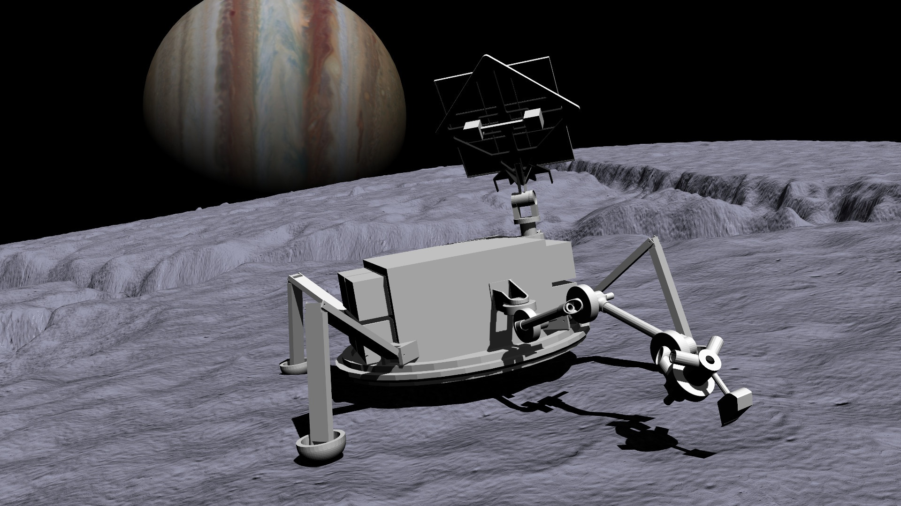

# Ocean Worlds Autonomy Testbed for Exploration Research & Simulation (OceanWATERS)
[Overview](#overview) |
[Code Organization](#code-Organization) |
[Getting Started](#getting-started) |
[Contributing](#contributing) |
[License](#license)

## Overview
OceanWATERS is a physical and visual simulation of a lander on Europa. It is intended as a
testbed to aid in producing software that could fly on lander missions to ocean
worlds, such as Europa and Enceladus.

## Code Organization

The [ow_simulator](https://github.com/nasa/ow_simulator) is the top level repository
for OceanWATERS. It primarily contains ROS/Gazebo packages related to visual and
physical simulation for OceanWATERS. It also contains workspace files for
setting up the rest of the OceanWATERS repositories:
- [ow_autonomy](https://github.com/nasa/ow_autonomy)
- [ow_europa](https://github.com/nasa/ow_europa)
- [irg_open](https://github.com/nasa/irg_open)

## Getting Started
Default build instruction use ROS Melodic, but you will also find an option to use experimental ROS Noetic support.
- [Install software prerequisites](oceanwaters/doc/setup_dev_env.md)
- [Download and build OceanWATERS](oceanwaters/doc/setup_oceanwaters.md)
- [User Guide](https://github.com/nasa/ow_simulator/wiki/Using-OceanWATERS)

## Contributing
Please review [current bugs and features requests](https://github.com/nasa/ow_simulator/issues)
before submitting a new one. If we are unable to accomodate your request and you
want to contribute to this project yourself, follow these instructions:

Contributions must be the original work of the contributor with no conflicting
license or copyright restrictions. See our [license](LICENSE.txt) for more
details.

If you wish to contribute code or a bug fix please:
- Create your own fork of this repository. In the upper-right corner of the
[ow_simulator front page](https://github.com/nasa/ow_simulator) click `Fork`.
Your fork will be called `<your_username>/ow_simulator`.
- In your newly forked repository, create a branch with an appropriate name for
your feature or bug fix.
- Make changes to your new branch.
- Create a pull request against the `master` branch of `nasa/ow_simulator`.

## Citation
Coming soon

## License
OceanWATERS is open source software licensed under the
[NASA Open Source Agreement version 1.3](LICENSE.txt).

## Notices
Copyright © 2020 United States Government as represented by the Administrator of
the National Aeronautics and Space Administration.  All Rights Reserved.

## Disclaimers
No Warranty: THE SUBJECT SOFTWARE IS PROVIDED "AS IS" WITHOUT ANY WARRANTY OF
ANY KIND, EITHER EXPRESSED, IMPLIED, OR STATUTORY, INCLUDING, BUT NOT LIMITED
TO, ANY WARRANTY THAT THE SUBJECT SOFTWARE WILL CONFORM TO SPECIFICATIONS, ANY
IMPLIED WARRANTIES OF MERCHANTABILITY, FITNESS FOR A PARTICULAR PURPOSE, OR
FREEDOM FROM INFRINGEMENT, ANY WARRANTY THAT THE SUBJECT SOFTWARE WILL BE ERROR
FREE, OR ANY WARRANTY THAT DOCUMENTATION, IF PROVIDED, WILL CONFORM TO THE
SUBJECT SOFTWARE. THIS AGREEMENT DOES NOT, IN ANY MANNER, CONSTITUTE AN
ENDORSEMENT BY GOVERNMENT AGENCY OR ANY PRIOR RECIPIENT OF ANY RESULTS,
RESULTING DESIGNS, HARDWARE, SOFTWARE PRODUCTS OR ANY OTHER APPLICATIONS
RESULTING FROM USE OF THE SUBJECT SOFTWARE.  FURTHER, GOVERNMENT AGENCY
DISCLAIMS ALL WARRANTIES AND LIABILITIES REGARDING THIRD-PARTY SOFTWARE, IF
PRESENT IN THE ORIGINAL SOFTWARE, AND DISTRIBUTES IT "AS IS."

Waiver and Indemnity:  RECIPIENT AGREES TO WAIVE ANY AND ALL CLAIMS AGAINST THE
UNITED STATES GOVERNMENT, ITS CONTRACTORS AND SUBCONTRACTORS, AS WELL AS ANY
PRIOR RECIPIENT.  IF RECIPIENT'S USE OF THE SUBJECT SOFTWARE RESULTS IN ANY
LIABILITIES, DEMANDS, DAMAGES, EXPENSES OR LOSSES ARISING FROM SUCH USE,
INCLUDING ANY DAMAGES FROM PRODUCTS BASED ON, OR RESULTING FROM, RECIPIENT'S USE
OF THE SUBJECT SOFTWARE, RECIPIENT SHALL INDEMNIFY AND HOLD HARMLESS THE UNITED
STATES GOVERNMENT, ITS CONTRACTORS AND SUBCONTRACTORS, AS WELL AS ANY PRIOR
RECIPIENT, TO THE EXTENT PERMITTED BY LAW.  RECIPIENT'S SOLE REMEDY FOR ANY SUCH
MATTER SHALL BE THE IMMEDIATE, UNILATERAL TERMINATION OF THIS AGREEMENT.
