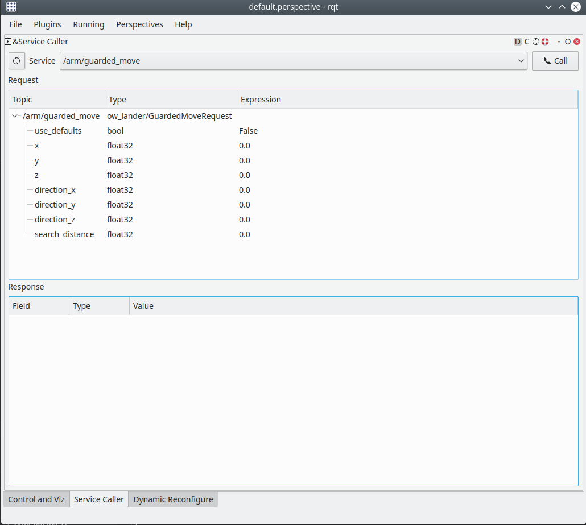
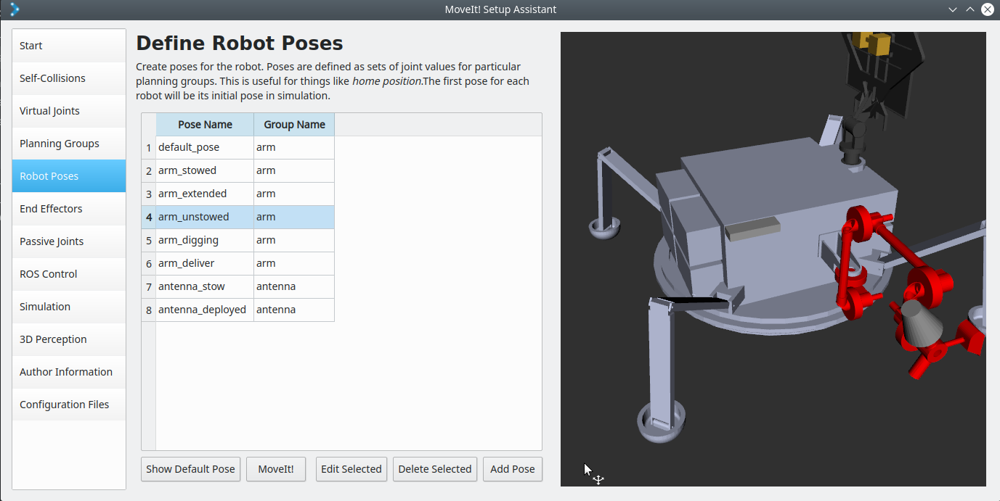

> The Notices and Disclaimers for Ocean Worlds Autonomy Testbed for Exploration
Research and Simulation can be found in README.md in the root directory of
this repository.

# ow_lander

Contains the lander semantic and kinematic descriptions (SRDF and URDF), the
moveit path planner and the gazebo trajectory feeder, and common code related
to the lander. The package also contains the definition and implementation of
several arm services

* [Requirements](#requirements)
* [Usage](#usage)
  - [Calling Arm Operations using RQT Service Caller](#calling-arm-operations-using-rqt-service-caller)
  - [Calling Arm Operations using ROS Command Line Interface](#calling-arm-operations-using-ros-command-line-interface)
* [MoveIt Setup Assistant](#moveit-setup-assistant)
* [Misc Information](#misc-information)
  - [Common Code](#common-code)
  - [Package History](#package-history)

## Requirements
To compile and run this package you need to have the following dependencies:
* ros-melodic-destkop-full
* ros-melodic-joint-trajectory-controller

## Usage

First run the simulation using any of the available OceanWATERS launch configurations:

```bash
roslaunch ow atacma_y1a.launch  # other options:
                                # * europa_terminator.launch
                                # * europa_terminator_workspace.launch
```

This will start the simulation, as well as loads available services to to control
the arm, you can interact with the exposed services using any of the two methds
described below:

### Calling Arm Operations using RQT Service Caller
When OceanWATERS sim is launched by default it starts an instance of **rqt_gui**
that has the _Service Caller_ plugin enabled. You can use the service caller
interface to invoke the different arm services that are exposed by the simulation.
Find the **rqt_gui** window then select the _Service Caller_ tab. Using the drop
down menu, select the service that you want to invoke (for example`/arm/dig_circular`
or `/arm/guarded_move`), configure the service arguments, as shown below:
<p align="center"></p>

Finally, press the `Call` button to invoke the service as configured.

### Calling Arm Operations using ROS Command Line Interface
Alternatively to using the **RQT Service Caller** gui interface, you may interact
with the services using the `rosservice` command line tool. While the simulation
is running, start a new terminal and source OceanWATERS workspace. Then, invoke
the services using their respective commands as listed below:


* Stow
```bash
rosservice call /arm/stow "{}"
```
* Unstow
```bash
rosservice call /arm/unstow "{}"
```
* Deliver Sample
```bash
rosservice call /arm/deliver_sample \
  "{use_defaults: true,
    x: 0.0, y: 0.0, z: 0.0}"
```
* Dig Linear
```bash
rosservice call /arm/dig_linear \
  "{use_defaults: true,
    x: 0.0, y: 0.0, depth: 0.0,
    length: 0.0, ground_position: 0.0}" 
```
* Dig Circular
```bash
rosservice call /arm/dig_circular \
  "{use_defaults: true,
    x: 0.0, y: 0.0, depth: 0.0,
    parallel: false, ground_position: 0.0}"
```
* Grind
```bash
rosservice call /arm/grind \
  "{use_defaults: true,
    x: 0.0, y: 0.0, depth: 0.0,
    length: 0.0,
    parallel: false, ground_position: 0.0}" 
```
* Guarded Move
```bash
rosservice call /arm/guarded_move \
  "{use_defaults: true,
    x: 0.0, y: 0.0, z: 0.0,
    direction_x: 0.0, direction_y: 0.0, direction_z: 0.0,
    search_distance: 0.0}"
```

> Note: Some of the exposed arm services take a number of arguments, the examples
provided here show running these service using default values. For more info on
the arguments of each of the services above, refer to the message declaration in
the .srv files.or use `rossrv` utility as shown here (replacing "foo" with the desired service name):
```bash
rossrv show -r foo
```

## MoveIt Setup Assistant
The moveit setup assistant can now be easily launched using the command:
```bash
roslaunch ow_lander setup_assistant.launch
```

Once the assistant is launched call the **Load Files** to load the current configuration.
The following image shows a screenshot of a successfully loaded lander configuration:
<p align="center"></p>

There are various reasons why you may need to re-run the setup assistant:
* Update the links collision matrix: this should be reconfigured again whenever
 links count, their shape or size changes or there was a change in the number of
 joints or their types.
* Define new arm/antenna poses or revise existing ones.

## ROS Actions

All the motion planning services have been converted into ROS
Actions. With ROS actions we can dynamically interact with the arm
while performing any of the above mentioned tasks and also receive
real-time feedback about the end effector's position.

The ROS Action server scripts, as well as client scripts to test the
actions, are found in the `scripts` directory.

## Misc Information

### Common Code
`include/ow_lander/lander_joints.h` contains joint names as they appear in the
URDF and related code. Please prefer this header over writing similar code
yourself to keep all our code consistent. If the lander is modified to change
the number of joints or any joint names, this header must be updated as well.

### Package History

* A major overhaul of this package was done after switching from JointPositionController
to JointTrajectoryController for arm services. Nonetheless, this revised version
is more comptabile with the file generated by the setup_assistant with few manual
edits. Refer to PR: [Oceanwater 518 switch to using effort controllers joint trajectory controller](https://github.com/nasa/ow_simulator/pull/40) for complete track of the set of changes.

* A force torque (FT) sensor was added to the arm on the distal pitch joint. For more information
refer to the the following PRs [Oceanwater 614 implement a force torque sensor for the lander arm](https://github.com/nasa/ow_simulator/pull/95) and refer to the 
related wiki page [Lander Simulation / Force Torque Sensor](https://github.com/nasa/ow_simulator/wiki/Lander-Simulation#force-torque-sensor) 

* ROS Action support was added to the package. For more information refer to [Oceanwater 534 implement current arm services as rosaction](https://github.com/nasa/ow_simulator/pull/66)
